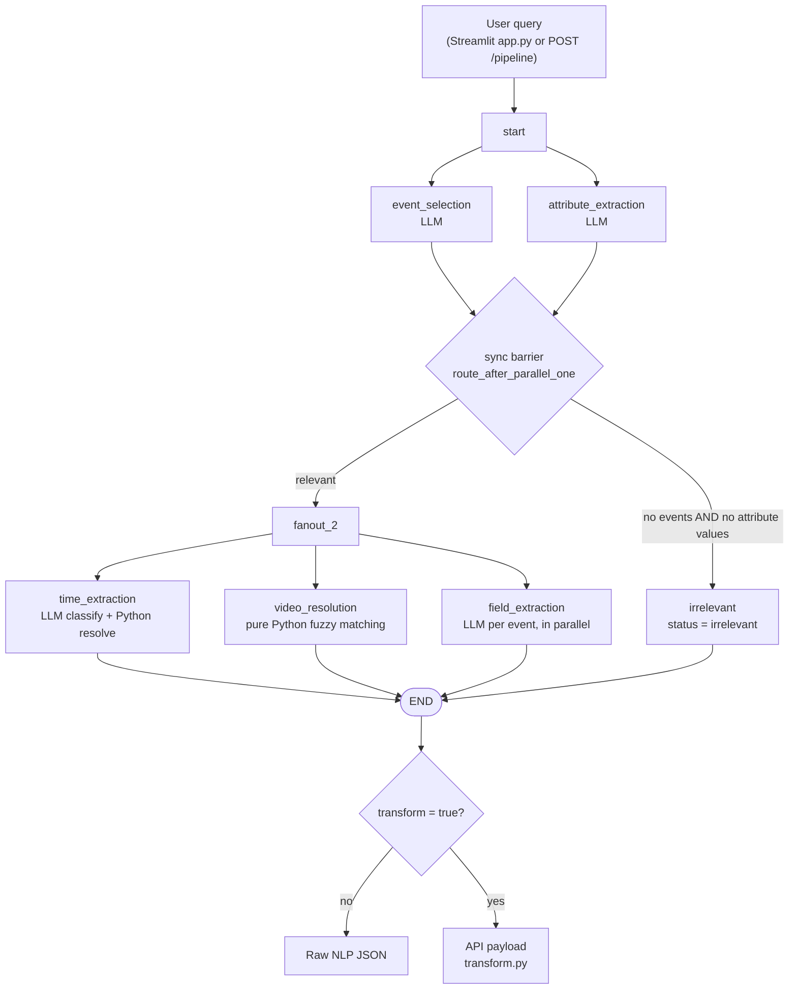

# Natural Language Query Pipeline: How It Works

> Companion doc: [STRUCTURE.md](STRUCTURE.md) goes through every folder and file one at a time.

---

## 1. What is this project?

It turns a **plain-English search query** into a **structured search request** that a video-surveillance / VMS (Video Management System) analytics backend can run.

A security operator types something like:

> *"Fetch events for last 7 days from ip source 192.168.9 for wanted person named Karan Desai showing angry emotion was seen riding stolen red bike with plate number HR5653RT78 violating traffic signal and speed limit, also check if his address is mg road, gurugram."*

The pipeline splits that query into five separate pieces:

| Dimension | What it answers | Example output from the query above |
|---|---|---|
| **Events** | *Which analytics produced the event?* | `Face Recognition Properties`, `ANPR Properties` |
| **Fields** | *Which filter conditions apply to each event?* | `emotion = angry`, `Category = Stolen`, `VehicleColor = Red`, `plateNumber = HR5653RT78`, `redLightViolated = true`, `speedViolated = true` |
| **Attributes** | *Which person/entity metadata to filter on?* | `address = "mg road, gurugram"` |
| **Time** | *Which time window?* | `04-09-2026 00:00:00` to `11-09-2026 <now>` |
| **Video resources** | *Which cameras?* | every camera whose IP starts with `192.168.9.` |

Each result also carries **source attribution**: the exact piece of the query that produced it (for example `"stolen red bike"` → `Category = Stolen`). The UI can show that to the user, and it makes errors easier to debug.

Finally, `transform.py` can turn all of this into the **exact JSON payload the downstream search API expects**. That means epoch-millisecond timestamps, camera UUIDs, and integer operator codes.

---

## 2. The core design idea: "the LLM classifies, the code computes"

The project is a **hybrid of LLM calls and deterministic algorithms**. The LLM handles only what needs language understanding. Anything that must be *exactly right* (date math, camera IDs, types, validation) is plain Python.

| Task | Who does it | Why |
|---|---|---|
| Which event types does the query mean? | **LLM** | Needs semantic understanding plus domain rules ("helmet + bike" means ANPR, "helmet + factory" means safety gear) |
| Which fields, operators and values apply? | **LLM** (function calling) | Needs language understanding, but the output is forced into a JSON schema |
| Attribute conditions | **LLM** | Same as above |
| Time: *what kind* of time expression is it? | **LLM** | "last week" vs "past week" vs "previous 3 weeks" is a language question |
| Time: *which dates* does it cover? | **Python** (calendar arithmetic) | LLMs are bad at date math. Code is exact and testable |
| Camera matching | **Python** (n-grams, fuzzy string matching, IP index) | Needs to be fast, deterministic, and able to cover thousands of cameras. No LLM involved |
| Validating every LLM output | **Python** (Pydantic, JSON Schema, rule tables) | Catches hallucinated events, fields, operators and values |

---

## 3. End-to-end flow

The pipeline is a **LangGraph state machine** (`graph.py`). Every node reads from and writes to one shared `PipelineState` dict (`state.py`). It has **two parallel stages**:



**Stage 1 (parallel):** event selection and attribute extraction run at the same time.

**Routing:** once both finish, the router in `graph.py` checks: *did we find at least one event, or at least one attribute condition with a real value?* If neither, the query is **irrelevant** and the pipeline stops there.

**Stage 2 (parallel):** time extraction, video resolution, and field extraction all run at the same time. Field extraction needs `matched_events` from stage 1, which is why it can't start any earlier.

**Merging parallel writes:** three parallel nodes all write to `source_attributions`. LangGraph would normally reject that, so `state.py` declares a **reducer** (`merge_source_attributions`) that merges the dicts: `{"time": …} + {"video": …} + {"fields": …}`.

---

## 4. Each stage and its algorithm

### 4.1 Event selection (LLM classification with a whitelist guard)
**Code:** `nodes/events/`

1. **Load the event catalog.** Every JSON file in `artifacts/events_schema/` is read in parallel (`asyncio.gather` + `aiofiles`). There are 15 today: ANPR, Face Recognition, Crowd Detected, Highway ATCC, Safety Gear Violation, Objects Entered, and others. Only the `title` and `description` of each are used.
2. **Build the prompt** (`prompt.py`). It contains:
   - domain definitions (vehicle/traffic vs workplace/pedestrian),
   - **7 disambiguation rules** (helmet, wrong-way vs reverse, speed, entry/crossing, count vs plate, face recognition triggers, motion analysis as the fallback),
   - a **multi-intent rule** (one query can map to several events),
   - a requirement to return the **exact query span** (`query_part`) that triggered each event.
3. **Call the LLM** with a 30 s timeout and **up to 3 attempts**.
4. **Parse** the reply with LangChain's `PydanticOutputParser`, which strips markdown fences and validates the result against the `MatchedEvents` model.
5. **Whitelist validation** (`validate.py`). Any `event_name` not in the catalog is dropped as a *hallucination*.
6. **Merge duplicates.** If the LLM returned the same event twice for different parts of the query, the two `query_part`s are joined into one entry.

### 4.2 Attribute extraction (LLM + typed two-stage validation)
**Code:** `nodes/attributes/`

Attributes are **person/entity metadata** keys declared in `artifacts/attributes.json`. Today that is only `address` (string). Real deployments would add keys like `aadhar` or `bank_number`.

1. The prompt lists the declared keys with their types, **16 operators** (`EQUAL`, `CONTAINS`, `IN`, `BETWEEN`, `WASUPDATED`, …), and the combiner types `ALL` (AND) / `ANY` (OR).
2. The LLM returns `{conditionType, conditions:[{key, operator, raw_value, raw_slice}]}`.
3. **Stage 1, `pre_validate`:** drops unknown keys, unknown operators, and items with no `raw_slice`.
4. **Stage 2, `build_conditions`:**
   - drops keys that appear more than once,
   - **type coercion** (`parser.parse_value`): `"42"` becomes `42`, `"yes"` becomes `True`, and multi-value operators split on commas into lists,
   - **operator/type compatibility matrix** (`constants.OPERATOR_RULES`): `GREATERTHAN` only works on numbers, `CONTAINS` only on strings, `BETWEEN` needs exactly `[min, max]` with `min ≤ max`, and so on.

### 4.3 Time extraction ("LLM classifies, code computes")
**Code:** `nodes/time/`. This is the most carefully engineered part of the project.

**Step 1: the LLM classifies the expression into a fixed taxonomy** of **6 intents and 18 subclasses**. The LLM only extracts *symbolic parameters* (`n_units="7"`, `unit="day"`). It never computes a date. The server's "today" isn't even included in the prompt.

| Intent | Subclasses | Examples |
|---|---|---|
| `none` | `no_temporal_reference` | "show crowd alerts" |
| `invalid` | `incomplete_expression`, `ambiguous_reference`, `conflicting_information`, `malformed_date` | "32 january 2024" |
| `relative` | `current_period`, `rolling_window`, `completed_period`, `future_window`, `offset_from_anchor_date` | "this week", "past 3 months", "last month", "next 7 days", "7 days before 10-09-2023" |
| `duration` | `full_year`, `single_month`, `month_to_month_range` | "2024", "March 2023", "Sep 2024 to Jan 2025" |
| `instant` | `today_or_yesterday`, `weekday_reference`, `specific_date` | "yesterday 9am–5pm", "last Monday", "23 Oct 2021" |
| `absolute` | `explicit_date_range`, `date_to_now_range` | "1 Jan 2024 to 5 Jan 2024", "since 01-06-2024" |

The prompt includes a **disambiguation table** for the hardest case, *last / past / previous*:
- `past` + unit → **rolling window** (a sliding window that ends now)
- `last` + **number** + unit → **rolling window** ("last 7 days")
- `last` + bare unit → **completed period** ("last week" means the previous Mon–Sun)
- `previous` → always a **completed period**

**Step 2: validation in three layers** (`validate.py`):
1. **Envelope:** a `PydanticOutputParser` checks that all 4 keys exist.
2. **Registry:** `INTENT_REGISTRY` in `constants.py` confirms the intent/subclass pair exists, every *required* param is present, and there are no unexpected params.
3. **Logical:** date format `DD-MM-YYYY`, time format `HHMMSS` in range, `n_units` is a positive integer, enum params hold allowed values, **end is after start**, month ranges are in order.

**Step 3: dispatch table to a resolver function** (`dispatcher.py` → `resolver.py`). A two-level dict `DISPATCHER[intent][subclass]` points to one pure function per subclass, and each function does plain calendar arithmetic with `datetime` and `calendar.monthrange`. Month arithmetic clamps the day (31 Jan + 1 month = 28/29 Feb). Quarters use a `QUARTER_BOUNDS` table.

**Outputs from a live run** (anchor = Friday 11-09-2026 14:30:00, validation + resolvers only, no LLM):

| Query | Subclass | Start | End |
|---|---|---|---|
| last 7 days | rolling_window | 04-09-2026 00:00:00 | 11-09-2026 14:30:00 |
| last week | completed_period | 31-08-2026 00:00:00 (Mon) | 06-09-2026 23:59:59 (Sun) |
| this quarter | current_period | 01-07-2026 00:00:00 | 11-09-2026 14:30:00 |
| last monday 9am to 5pm | weekday_reference | 07-09-2026 09:00:00 | 07-09-2026 17:00:00 |
| yesterday | today_or_yesterday | 10-09-2026 00:00:00 | 10-09-2026 23:59:59 |
| March 2024 | single_month | 01-03-2024 00:00:00 | 31-03-2024 23:59:59 |
| 7 days before 10-09-2023 | offset_from_anchor_date | 03-09-2023 00:00:00 | 10-09-2023 23:59:59 |
| 32 january 2024 | malformed_date → `resolve_null` | today 00:00:00 | now |

The **end-time rule:** if the range ends today, it ends *now*. If it ends on a past day, it ends at 23:59:59.

**Fallback:** if anything fails (timeout, bad JSON, crash), the result is **today 00:00:00 → now**, with an error flag.

### 4.4 Video resource resolution (pure algorithm, no LLM)
**Code:** `nodes/video_resource/`

This stage maps words in the query to cameras from `artifacts/video_resources.json`. The file currently holds 97 cameras such as `SECL_KSM_PIT_CAM02` and `PAPA_JOHNS_ENTRY_CAM01`. The code also supports a folder tree (site → building → camera). In that case, matching a folder name selects every camera beneath it.

**Indexes built at load time** (`tree.py`):
- `flat`: a list of every camera with its folder path
- `node_index`: folder name → all cameras in that folder's subtree (empty for the current flat data)
- `ip_index`: IP → camera, for O(1) lookup

**Algorithm, per query:**

1. **Clause splitting.** Split on `,` and on the whole word `and`. For example, "papa johns entry **and** dr pepper entry" becomes 2 clauses. Each clause is resolved separately and the results are **unioned**.
2. **IP fast path.** A regex finds IPv4 literals. `192.168.1.5` is an **exact** match with confidence 100. A 3-octet prefix like `192.168.9` matches **the whole subnet** with confidence 75. IPs are then removed from the text.
3. **Stopword removal.** A hand-curated list of about 200 words ("show", "footage", "from", "today", "zone", …) chosen so that removing them can never change which camera is meant. `cam` is deliberately *kept* because `CAM01` matters.
4. **N-gram generation.** Every n-gram of every length is emitted, **longest first**, and each one keeps its word positions. Compound words like `SECL_KSM_SARANGI` are also emitted as a single token first. Letters and digits are split apart (`cam01` → `cam 01`).
5. **Scoring each token against each camera/folder name** (`matching.py`), as a cascade:
   - **exact**: the normalized strings are equal → 100
   - **partial**: one is a substring of the other and the shorter one is at least 50% of the longer one's length → `max(fuzzy, 80)`
   - **fuzzy**: **RapidFuzz `token_set_ratio`**, with two extra rules:
     - **digit guard:** every number in the token must also appear in the candidate. So "cam 02" can never match "cam 03".
     - **coverage penalty:** if the token's words are a strict subset of the name's words, `score = base × (coverage ^ 0.4)`. This stops a short query from matching a long name too loosely.
   - accepted only if the score is **≥ 75** (`FUZZY_THRESHOLD`)
6. **Picking the best candidate per token** uses lexicographic tie-breaking: `(match type, −confidence, folder-before-camera, shallower folder, smaller subtree)`.
7. **Greedy non-overlapping selection.** Matches are sorted *most specific first* (fewest cameras). Any match whose word positions are already fully used gets skipped. So "SECL KSM pit cam 02" wins as a single span instead of also matching "pit" separately.
8. **AND-intersection.** The camera sets of the selected matches are intersected, so "korba security gate" narrows down to cameras that match all three. **If an intersection would come out empty, that constraint is skipped** instead of returning nothing.
9. **Group and sort** the results by `(match type, −confidence)`. Each group keeps its `matched_token` and `matched_raw_slice` for attribution.

**Outputs from a live run against the real `video_resources.json`:**

| Query | Result |
|---|---|
| `show footage from SECL KSM pit cam 02` | fuzzy 100 → `SECL_KSM_PIT_CAM02` |
| `events from 192.168.1.5` | ip 100 → `SECL_KSM_CAT_FACE` |
| `ip source 192.168.9` | ip-prefix 75 → `PAPA_JOHNS_ENTRY_CAM01`, `DR_PEPPER_ENTRY_CAM01` |
| `papa johns entry and dr peper entry` *(typo)* | partial 81.5 → `PAPA_JOHNS_ENTRY_CAM01`; fuzzy 77.8 → `DR_PEPPER_ENTRY_CAM01` |
| `camera sarangi` | **no match** (see known issues) |

### 4.5 Field extraction (LLM function calling + two-stage JSON Schema validation)
**Code:** `nodes/fields/`

This runs **once per matched event, all in parallel** (`asyncio.gather(..., return_exceptions=True)`, so one failing event doesn't take the others down).

1. **Load that event's JSON Schema.** The event title maps to a filename: `"ANPR Properties"` → `anpr.json`.
2. **Build a tool (function) schema dynamically** (`schema_loader.build_tool_schema`):
   - `field` is an **enum** of that event's real property names, so the LLM can't invent a field,
   - `operator` is an enum of the 13 allowed operators,
   - `value` is a union type (string, number, boolean, or array),
   - each field's type, enum and description go into the tool description as context.
3. **Call the LLM with structured output**: `with_structured_output(tool_schema, method="function_calling")`, 20 s timeout. The prompt adds rules like *"each field at most once"* and *"prefer the most specific operator: Equal > In > Between > Contains > Like"*.
4. **Drop entries with a null** field, operator, value or snippet.
5. **Stage 1 validation:** each item is checked against the tool item schema with `jsonschema` Draft 2020-12.
6. **Stage 2 validation** (`ResponseValidator`):
   - the field must exist in the event schema,
   - no duplicate fields,
   - the **operator must be compatible with the field type** (`GreaterThan` only on numbers, `Contains` only on strings, `Between` needs `[min, max]`),
   - the value must validate against the event schema itself, so **enums and minimums are enforced**. `VehicleColor` must be one of `Red, Green, Blue, Yellow, Orange`, and `speed ≥ 0`.

### 4.6 Transform to the API payload
**Code:** `transform.py`. It runs when `POST /pipeline` has `"transform": true`.

| Pipeline output | Becomes |
|---|---|
| `time.start/end` (`DD-MM-YYYY` + `HH:MM:SS`, read as **IST**) | `startTime` / `endTime` in **UTC epoch milliseconds** |
| `resolved_cameras` (names) | `resources.Video_Sources`: camera **UUIDs** looked up from `video_resources.json` |
| `"ANPR Properties"` | analytics key `"ANPR"` |
| each field rule | `propertyFilters[<key>] = {condition: "AND", rules:[{field, operator:<int code>, value, type:<ruleType>}]}` |
| attribute conditions | `AttributeFilters = {field:"attributes", operator: 15(ALL) or 14(ANY), type:21, value:"<JSON string of inner rules>"}` |
| `status == "irrelevant"` | a default payload: today 00:00 → now, no filters |

Paging (`pageNumber: 1`, `pageLimit: 50`, `order: DESC`) is fixed.

---

## 5. Error handling: "never crash, always return a valid shape"

Every node is wrapped in a `*FallbackHandler` class. The rule: **a node never raises into the graph.** It always returns a well-formed result plus an error object marked `"recovered": true`.

| Stage | On failure it returns |
|---|---|
| Event selection | `matched_events: []` and `status: "irrelevant"`, or a typed error (`LLMException`, `TimeoutException`, …) |
| Attribute extraction | `conditions: []` and `attribute_extraction_error` |
| Time | **today 00:00:00 → now** (a safe default window) |
| Video | `groups: []`, `resolved_cameras: []` |
| Fields | a per-event entry with `relevant_fields: []` and an error. **Other events still succeed** |

`exceptions.py` defines a typed hierarchy (`NLIPipelineException` → `EventSelectionException`, `LLMException`, `TimeoutException`, …). Each has an `error_code` and a `to_dict()` for API responses.
`logger.py` writes **structured JSON logs** to the console and to a rotating `pipeline.log` (10 MB × 5). A `request_id` and `node_name` travel along with each request through `contextvars`.

---

## 6. How quality is measured (evaluation loop)

The repo includes a complete **human-in-the-loop evaluation workflow**:

```
queries.jsonl ──► evaluate/response_generator.py ──► response.jsonl
                     (calls /debug/<stage>)                │
                                                           ▼
                                   annotate/*.py  (Streamlit review tools)
                                   a human corrects the LLM output
                                                           │
                                                           ▼
                                                   annotated.jsonl
                                                           │
                                                           ▼
                        evaluate/metric/{events,fields,time}.py ──► results/*.json
```

- **Metrics:** precision, recall, F1, and Jaccard "accuracy" = TP/(TP+FP+FN), both **macro** and **micro** averaged. Events and fields use **multiset** counting: TP = min(pred count, gold count) per label.
- Fields can be scored on field name only, or strictly with `--match_operator` / `--match_value`.

**Stored results** in `evaluate/results/`:

| Stage | Dataset | Micro precision | Micro recall | Micro F1 |
|---|---|---|---|---|
| Event selection | 717 queries | 98.0% | 97.1% | **97.5%** |
| Field extraction (field name) | 610 queries | 99.1% | 77.5% | **87.0%** |
| Time intent | 308 queries | 93.8% | 93.8% | **93.8%** |

What these numbers say:
- **Events are strong.** The weakest is *Illegal Vehicle* at 60.9% precision, because it gets over-selected.
- **Fields have very high precision but lower recall.** The model tends to *leave a field out* rather than invent one. *Vehicle Accelerated* and *Illegal Vehicle* score 0% (see known issues).
- **Time:** the weakest category is `invalid`, where `ambiguous_reference` recall is only 37.5%.

---

## 7. Algorithms and techniques at a glance

| Technique | Where | Purpose |
|---|---|---|
| LangGraph `StateGraph` with fan-out/fan-in + conditional routing | `graph.py` | Runs independent stages in parallel and short-circuits irrelevant queries |
| State reducer (dict merge) | `state.py` | Lets parallel nodes write to the same key safely |
| Prompt engineering: taxonomy, disambiguation rules, self-check step | `nodes/*/prompt.py` | Makes the LLM's classifications consistent |
| Temperature 0 | `llm/client.py` | Deterministic LLM output |
| OpenAI function calling / structured output with a dynamic JSON Schema | `nodes/fields/` | Forces valid shapes and restricts fields to an enum |
| Pydantic output parsing | events, time | Strips code fences and validates structure |
| Whitelist validation (hallucination filter) | events | Drops event names that don't exist |
| JSON Schema Draft 2020-12 validation | fields | Enforces enums, minimums, types |
| Operator/type compatibility matrices | attributes, fields | Rejects invalid operator/type pairs such as `GreaterThan` on a string |
| Registry + dispatch table (strategy pattern) | time | One pure resolver per subclass, easy to extend |
| Calendar arithmetic with month-end clamping | `nodes/time/resolver.py` | Exact date ranges |
| Regex IP extraction + O(1) IP index + prefix scan | video | Exact and subnet camera lookup |
| Stopword filtering + all-length n-grams, longest first | video | Finds the best multi-word span |
| Exact → partial → fuzzy scoring cascade (**RapidFuzz token_set_ratio**) with digit guard and coverage penalty | video | Handles typos without false matches |
| Greedy non-overlapping span selection + set intersection that skips empty results | video | Multi-word narrowing without over-constraining |
| Retries with timeouts (`asyncio.wait_for`) | events, time, fields | Resilience against a slow or flaky LLM |
| SHA-256 content hashing for change detection + LLM-written docs | `sync/` | Syncs event schemas from the platform incrementally |
| Multiset precision/recall/F1, macro + micro | `evaluate/metric/` | Measures quality |

---

## 8. Tech stack

| Layer | Technology |
|---|---|
| UI | Streamlit (`app.py`, plus 3 annotation tools in `annotate/`) |
| API | FastAPI + Uvicorn (port 8081) |
| Orchestration | LangGraph 1.0 |
| LLM access | LangChain `ChatOpenAI`, which works with any OpenAI-compatible endpoint via `LLM_BASE_URL` |
| Validation | Pydantic v2, `jsonschema` |
| Fuzzy matching | RapidFuzz |
| Config | `pydantic-settings` reading `.env` |

---

## 9. Known issues found during this analysis

The first four were **verified by running the code or checking the files**. The rest come from reading the code.

1. **Vehicle Accelerated fields never extract (verified).** The schema file is named `vehicle_accelated.json` (typo), but `normalize_event_to_filename("Vehicle Accelerated Properties")` looks for `vehicle_accelerated.json`. So every call ends in `schema_load_failed`, which is why that event scores **0% field F1**. Fix: rename the file.
2. **`ruleType` is always 1 in the transformed payload (verified).** `transform.get_rule_type` looks for `<KEY>_EventProperties.json` (for example `ANPR_EventProperties.json`), but files are named `anpr.json`. The lookup always fails and falls back to type 1 (string), even for numbers and booleans.
3. **Single-word camera queries can fail (verified).** `"camera sarangi"` returns nothing even though `SECL_KSM_SARANGI` exists. The partial match needs the token to be at least 50% of the name's length, and the fuzzy coverage penalty turns 100 into ~64, below the 75 threshold.
4. **Missing and unused dependencies (verified).** The code imports `aiofiles` and `jsonschema`, but neither is in `requirements.txt`. `dateparser`, `opik`, `litellm` and `tenacity` are listed but never imported.
5. **`completed_period` ignores `n_units`.** "previous 3 months" validates with `n_units="3"`, but the resolver always returns just 1 period.
6. **Field extraction only sees `query_part`, not the full query.** If the event span is `"multiple violations"`, details mentioned elsewhere in the query (zone, type) never reach the field LLM. This likely contributes to the 0% on *Illegal Vehicle*.
7. **Timezone assumption.** Time anchors use the server's local clock (`datetime.now()`), but `transform.py` reads those times as **IST**. On a server that isn't set to IST, the epoch timestamps shift.
8. **Two different operator numbering schemes.** Fields use list indexes (`In = 8`, `Between = 10`), while attributes use the `Operators` enum (`IN = 9`, `BETWEEN = 11`). Worth confirming which one the downstream API expects.
9. **An "irrelevant" status can hide real results.** If event selection fails (status `irrelevant`) but attributes were found, the graph still runs time/video/fields, but `POST /pipeline` sees `status == "irrelevant"` and throws those results away.
10. **Smaller issues:**
    - `api/handlers.py` returns a plain `dict` from an exception handler, but FastAPI requires a `Response` object.
    - The logger's `hasattr(record, "extra")` check means `extra={...}` fields never show up in the logs.
    - The event prompt mentions a "Wrong Way Detected" event that has no schema.
    - Typos: `llm/__int__.py` and the route `/artifacts/video_resouces`.
    - The README doesn't mention `LLM_BASE_URL`, which is required.
